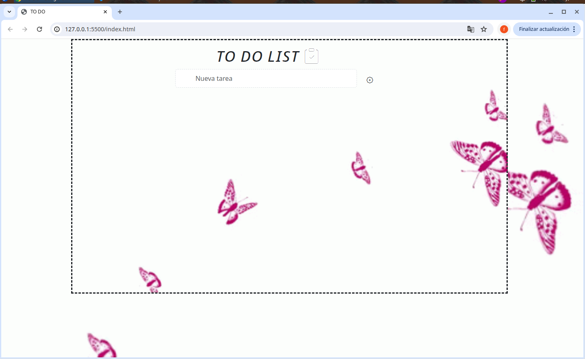
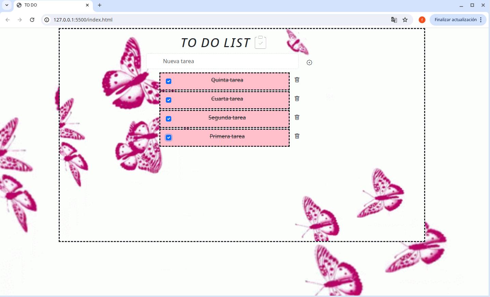

# TO-DO-DOM
Este to do esta hecho con HTML, JAVASCRIPT, CSS Y BOOTSTRAP.

Es una nueva experiencia al hacer poder usar todo junto., fue un proceso de tres dias., use icono de bootstrap, y en css y le coloque el tamaño a cada imagen. 

